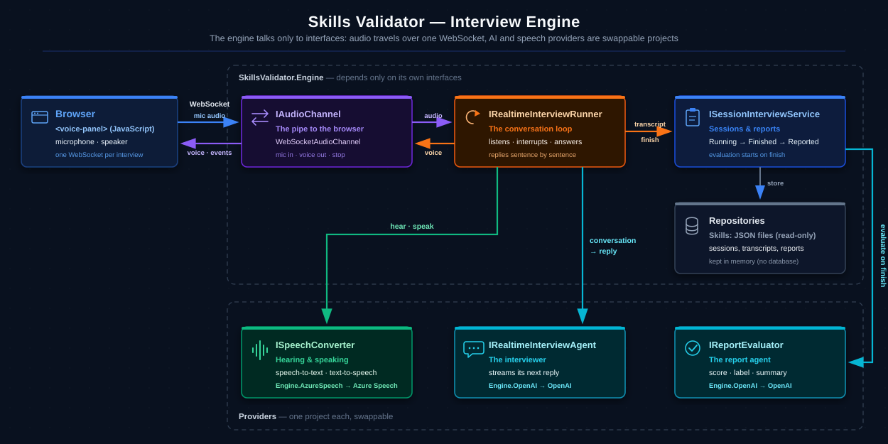

# Skills Validator

A real-time **voice interview** with an AI agent that validates a participant's skill.
Pick a skill, enter your name and talk: the agent interviews you out loud, adapts the questions to your answers, and at the end a second agent evaluates the conversation and gives you a report with a score, a level, your strong points and what to improve.

Built with **.NET 9**, **Blazor Server**, **OpenAI** (through Microsoft.Extensions.AI) and **Azure Speech**.



## Features
- **Real-time voice conversation:** the agent speaks and listens; replies are spoken sentence by sentence, so they start in about a second.
- **Natural turn-taking:** interrupt the agent just by speaking, and pause to think without it jumping in.
- **Live caption** of what you are saying, plus the full transcript.
- **Time-aware:** each skill has a planned duration and extra time, and the agent manages both.
- **Report:** score from 1 to N, a level label, a summary, strong points and areas to improve.
- **Skills are JSON files:** add a new skill without changing any code.
- **Swappable providers:** the AI agents and the speech service are behind interfaces, each in its own project.

## Getting started

### What you need
- [.NET 9 SDK](https://dotnet.microsoft.com/download/dotnet/9.0)
- An **OpenAI** API key ([create one here](https://platform.openai.com/api-keys); the API is paid per use)
- An **Azure Speech** resource ([create one here](https://portal.azure.com/#create/Microsoft.CognitiveServicesSpeechServices); the free F0 tier is enough): its key and region from **Keys and Endpoint**
- A microphone, **headphones** for the best results, and Chrome or Edge

### Run
Set the keys with **user-secrets**, so they never end up in the code:

```bash
dotnet user-secrets set "OpenAI:ApiKey" "<your OpenAI key>" --project src/SkillsValidator.Web
dotnet user-secrets set "AzureSpeech:Key" "<your Azure Speech key>" --project src/SkillsValidator.Web
dotnet user-secrets set "AzureSpeech:Region" "<your region, e.g. eastus>" --project src/SkillsValidator.Web
```

Start the app:

```bash
dotnet run --project src/SkillsValidator.Web
```

Open [http://localhost:5101](http://localhost:5101), choose a skill, type your name and click **Start interview**. On the interview page, click **Start talking** and allow the microphone.

If a key or a skill file is missing or wrong, the start page tells you what to fix.

## Skills
Every skill is a JSON file in [`src/SkillsValidator.Web/skills`](src/SkillsValidator.Web/skills). The repo comes with C# Programming, SQL, Star Wars Lore, Pokémon Knowledge and Naruto Knowledge.

```json
{
  "Id": "star-wars",
  "Title": "Star Wars Lore",
  "InterviewInstruction": "Test the participant's knowledge of the Star Wars universe...",
  "AgentTone": "Warm and playful, like a wise old Jedi master.",
  "AgentName": "Master Oren",
  "AgentVoiceGender": "Male",
  "AgentVoiceType": "Deep",
  "Effort": "Low",
  "ReportInstruction": "Evaluate breadth and depth of lore knowledge.",
  "MaxPoints": 4,
  "InterviewDurationInMinutes": 10,
  "ExtraInterviewDurationInMinutes": 2,
  "PointInstructionMap": {
    "1": { "Label": "Youngling", "Requirements": "Knows the main characters." },
    "2": { "Label": "Padawan", "Requirements": "Knows the plot of the main films." },
    "3": { "Label": "Jedi Knight", "Requirements": "Knows the history of the Jedi and the Sith." },
    "4": { "Label": "Jedi Master", "Requirements": "Knows deep lore, including series and books." }
  }
}
```

| Field | Purpose |
|---|---|
| `Title` | Name shown in the skill list |
| `InterviewInstruction` | What the agent should ask and which topics matter most |
| `AgentName`, `AgentTone` | Who the agent is and how it behaves |
| `AgentVoiceGender`, `AgentVoiceType` | The agent's voice (Male/Female; HighPitched, Neutral, Deep, Warm) |
| `Effort` | Which AI model to use: Low, Medium or High (optional, default Medium) |
| `ReportInstruction` | How to evaluate and what to put in the report |
| `MaxPoints` | The highest possible score |
| `InterviewDurationInMinutes`, `ExtraInterviewDurationInMinutes` | Planned duration and extra time |
| `PointInstructionMap` | A label and the minimum requirements for **every** point from 1 to `MaxPoints` |

To add a skill, drop a new JSON file in that folder and restart the app.

## Configuration
Everything except the keys lives in [`appsettings.json`](src/SkillsValidator.Web/appsettings.json):

| Setting | What it does |
|---|---|
| `OpenAI:Models` | The OpenAI model for each effort level (`Low`, `Medium`, `High`) |
| `AzureSpeech:SilenceTimeoutMs` | How long the participant can be silent before the agent answers (default 2000 ms) |
| `AzureSpeech:Language` | The language the participant speaks (default `en-US`) |
| `AzureSpeech:Voices` | The Azure voice for each gender and voice type |

## Project structure

| Project | What's inside |
|---|---|
| `SkillsValidator.Engine` | Models, interfaces, the session service, the realtime conversation loop and the prompts. No vendor SDK. |
| `SkillsValidator.Engine.OpenAI` | The interviewer and the report agents (`IRealtimeInterviewAgent`, `IReportEvaluator`) |
| `SkillsValidator.Engine.AzureSpeech` | Speech-to-text and text-to-speech (`ISpeechConverter`) |
| `SkillsValidator.Web` | Blazor Server UI, the voice WebSocket endpoint and the `<voice-panel>` web component |
| `SkillsValidator.Tests` | xUnit tests, including the whole voice protocol over a real WebSocket with fake providers |

To try another provider, add a sibling project that implements the interface and swap one line in [`Program.cs`](src/SkillsValidator.Web/Program.cs).

## How the voice works
The browser opens one WebSocket per interview, at `/interview/{sessionId}/voice`:

| Direction | Frame | Content |
|---|---|---|
| browser → server | binary | Microphone audio, 16-bit PCM at 16 kHz, 100 ms per frame |
| server → browser | binary | Agent voice, 16-bit PCM at 24 kHz, one sentence per frame |
| server → browser | text | `{"type":"caption"}`, `{"type":"stop"}`, `{"type":"ended"}`, `{"type":"error"}` |

## Keep it simple
This is sample code, so some things are deliberately left out: there is **no login** (just a name), **no database** (sessions live in memory and are lost when the app restarts) and **no audio is stored**, only the text transcript.

## Tests

```bash
dotnet test
```
